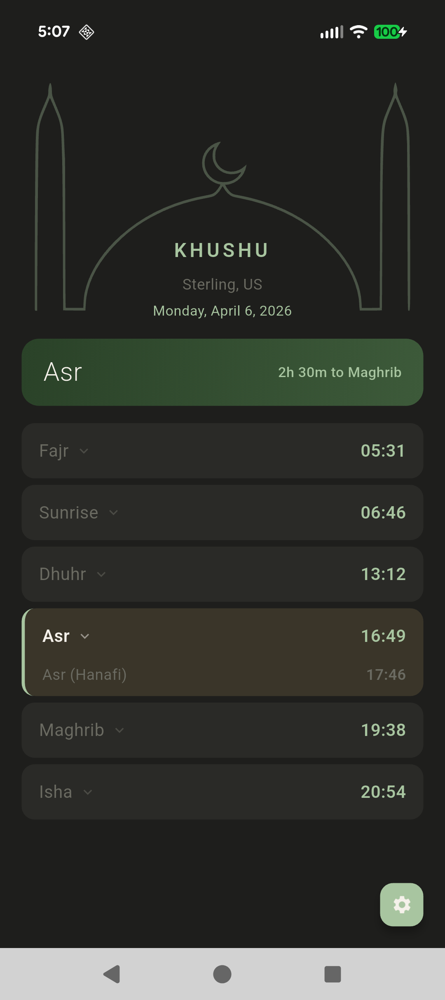
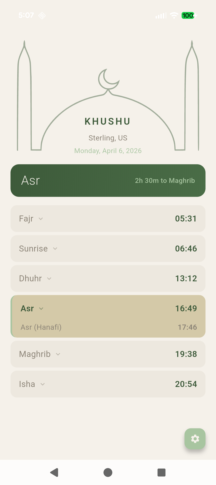

# Khushu خشوع

**One Ummah Serving Allah**

An Islamic prayer app with a clean, simple interface to help you wherever you are in your salat journey.

<p align="center">
  
  &nbsp;&nbsp;
  
</p>

## Features

- **Accurate prayer times** for Sunni and Shia fiqhs via the [AlAdhan API](https://aladhan.com)
- **Prayer guide** — tap any prayer to see rakat breakdown for your fiqh
- **Auto-detect location** — GPS with manual city fallback
- **Regional calculation methods** — auto-selects based on your location
- **Light & dark mode** — follows your system theme

## Tech

- **Flutter** (Dart) — cross-platform Android & iOS
- **Riverpod** — state management
- **Hive** — local caching (prayer times cached daily)
- **AlAdhan API** — prayer time calculations
- **FVM** — Flutter version management

## Development

```bash
# Install FVM if you don't have it
dart pub global activate fvm

# Install Flutter version pinned to this project
fvm install

# Get dependencies
fvm flutter pub get

# Run on connected device
fvm flutter run

# Run tests
fvm flutter test
```

## Roadmap

1. **Prayer guide** — tap to see rakat counts per fiqh *(done)*
2. Hijri calendar
3. Adhan alerts with audio
4. Offline prayer calculation (adhan-dart)
5. Qibla compass
6. Multi-language support
7. App Store & Play Store release

## License

Open source. Free. Ad-free. For the Ummah.
